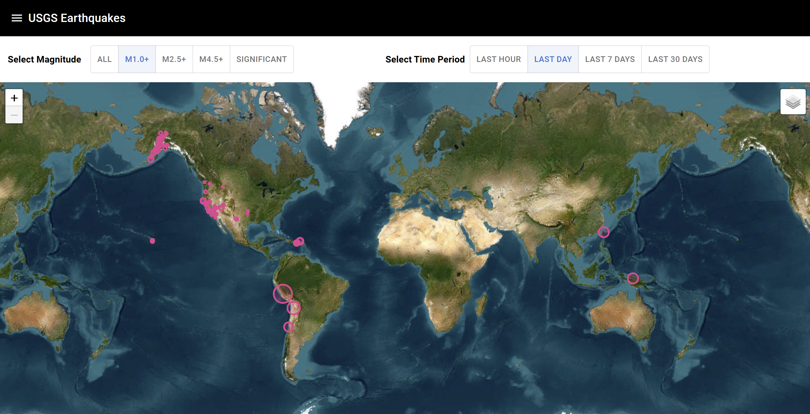

# WID 7 - Hausaufgabe

## Getting started

### Installieren

`npm` Abhängigkeiten installieren:

```sh
npm install
```

`npm` Dev-Server starten:

```sh
npm run dev
```

## Funktion

In dieser WebApp werden die Erdbebendaten der letzten 30 Tage dargestellt. Es kann zwischen verschiedenen Magnituden und Zeitintervallen gewechselt werden.

Die Daten stammen von der USGS: https://www.usgs.gov/

## Screenshot der WebApp


